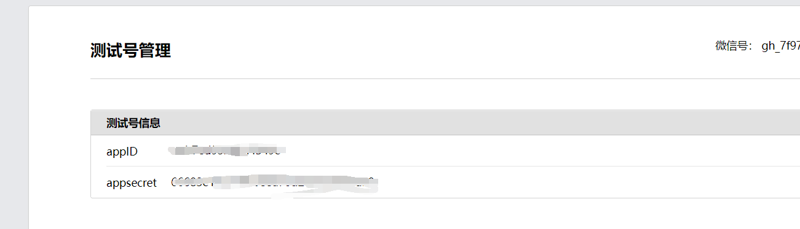

# 微信每日早安推送
效果和网络上其他代码都大差不差，不过当地习俗是按照阴历过生日的，所以距离下一个生日是和阴历生日对应的
## 效果

## 代码地址
[微信推送](https://gitee.com/nameiszwy/wechat-push)

## 配置
只需要按照备注修改为你自己的数据就可以了

### 微信公众号
正常企业开发，实现微信模版消息推送，必须要有微信公众号，而现在个人基本上无法进行微信认证，必须用组织或者企业的才行，还需要备案的网址，并且最麻烦的一点是要获取到用户的openid，
作为个人，这些条件基本上都不容易实现。所以今天就来带大家注册微信开发测试账号，来轻松实现微信模版消息推送。   
[微信公众号](https://mp.weixin.qq.com/debug/cgi-bin/sandbox?t=sandbox/login)  
1. 扫码登录后拿到appid和appsecret（wechat.appId和wechat.secret）
    
2. 下面有一个测试号二维码，让你对象扫码关注，自己也可也关注用作测试（target.openId）
   
3. 新增测试模板->模板标题随便写，越肉麻越好->模板内容参考wechat-push/src/main/resources/templates/模板.txt（wechat.templateId）
   
   

### 接入百度天气api
[百度天气](https://lbsyun.baidu.com/apiconsole/center#/home)
1. 注册账号，一步一步来就行
2. 获取AK
    
   
    下滑
   
   提交后就能获得AK了（weather.ak）

### 接入彩虹屁api
[彩虹屁](https://www.tianapi.com/apiview/181)
1. 注册账号，获得key
  
2. 进入控制台，复制key（tian.caihongpi.key）

## 运行
运行src/main/java/work/sajor/wechatpush/WechatPushApplication